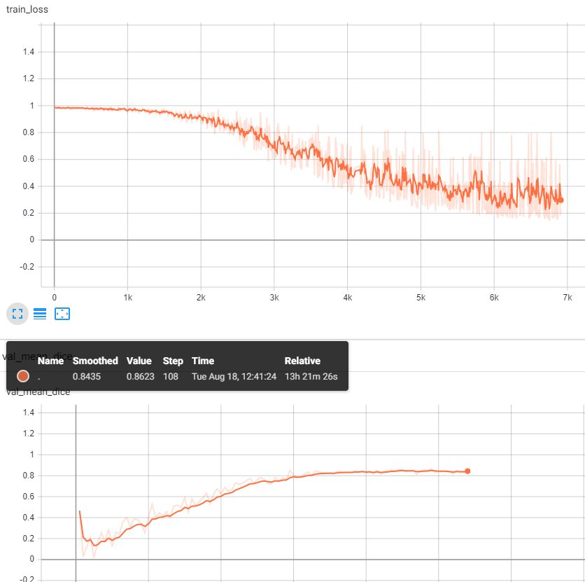
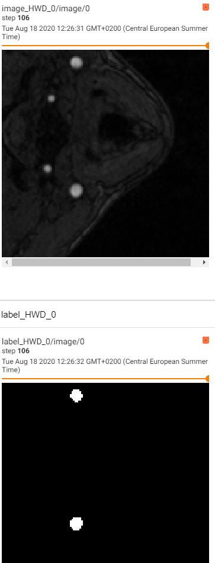

# SALMON: Segmentation deep learning ALgorithm based on MONai toolbox
SALMON is a computational toolbox for segmentation using neural networks.
SALMON is based on MONAI: a PyTorch-based, open-source framework for deep learning in healthcare imaging. (https://github.com/Project-MONAI/MONAI)
*******************************************************************************
## Requirements
See requirements.txt list
*******************************************************************************
## Python scripts and their function

- organize_folder_structure.py: Organize the data in the folder structure for the network

- init.py: List of options used to train the network. 

- check_loader_patches: Shows example of patches fed to the network during the training  

- networks.py: the architectures available for segmentation.

- train.py: Runs the training

- predict_single_image.py: It launches the inference on a single input image chosen by the user.
*******************************************************************************
## Usage

1.Use first organize_folder_structure.py to create organize the data in the following folder structure.
Folder Structure:

	.
	├── Data_folder                   
	|   ├── train              
	|   |   ├── images             # Training
	|   |   |   ├── image1.nii              
	|   |   |   └── image2.nii                     
	|   |   └── labels             
	|   |   |   ├── label1.nii              
	|   |   |   └── label2.nii              
	|   ├── val               
	|   |   ├── images             # Validation
	|   |   |   ├── image3.nii              
	|   |   |   └── image4.nii              
	|   |   └── labels             
	|   |   |   ├── label3.nii              
	|   |   |   └── label4.nii              
   

2.Modify the init.py to set the parameters and start the training/testing on the data.
Afterwards launch the train.py for training. Tensorboard is available to monitor the training:	

3.Launch predict_single_image.py to test the network. Modify the parameters in the parse section to select the weights and images to infer.
*******************************************************************************
### To Do
- correct parse section in predict_single_image.py (conflict between opt and args.parse)
- add more networks structures in network.py
- implement it for multilabel segmentation in the same script. (call multilabel losses)
